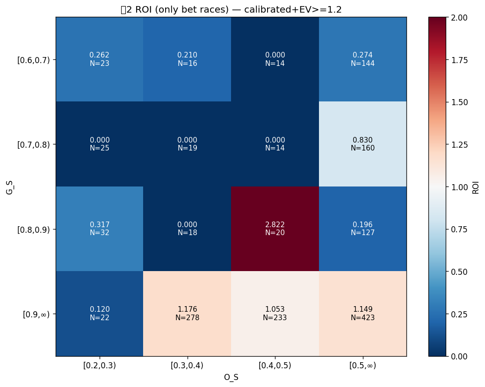

# Phase C 最終戦略レポート

## 背景
キャリブレーション+EV≥1.2 の既存データを**再バックテストせず集計**で解析.

- 現状 (全型): ROI 0.9539
- 型1: 0.9974 / 型2: 0.8510 / 型3: 1.1119

## Step 1: シナリオ別 ROI

| シナリオ | 型 | N_bet | hit | profit | ROI | CI下 | CI上 | 月別 std |
|---|---|---|---|---|---|---|---|---|
| 現状 | 型1+型2+型3 | 4,939 | 279 | ¥-683,698 | **0.9539** | 0.8451 | 1.0626 | 0.0483 |
| A 型2見送り | 型1+型3 | 3,371 | 187 | ¥+17,289 | **1.0017** | 0.8622 | 1.1412 | 0.1156 |
| B 型1のみ | 型1 | 3,243 | 182 | ¥-25,681 | **0.9974** | 0.8566 | 1.1381 | 0.1131 |
| C 型3のみ | 型3 | 128 | 5 | ¥+42,970 | **1.1119** | 0.1565 | 2.0673 | 0.8195 |
| D 型3見送り | 型1+型2 | 4,811 | 274 | ¥-726,668 | **0.9497** | 0.8405 | 1.0588 | 0.0333 |

## Step 2: 型2 内部分析

### 軸1: G_S 帯別 ROI

| G_S 帯 | N | hit | ROI | CI下 | CI上 |
|---|---|---|---|---|---|
| [0.6, 0.7) | 197 | 5 | **0.2479** | 0.0334 | 0.4624 |
| [0.7, 0.8) | 218 | 13 | **0.6090** | 0.2880 | 0.9300 |
| [0.8, 0.9) | 197 | 8 | **0.4647** | 0.1493 | 0.7801 |
| [0.9, ∞) | 956 | 66 | **1.1100** | 0.8516 | 1.3684 |

### 軸2: O_S 帯別 ROI

| O_S 帯 | N | hit | ROI | CI下 | CI上 |
|---|---|---|---|---|---|
| [0.2, 0.3) | 102 | 4 | **0.1844** | 0.0073 | 0.3616 |
| [0.3, 0.4) | 331 | 21 | **0.9978** | 0.5848 | 1.4108 |
| [0.4, 0.5) | 281 | 16 | **1.0742** | 0.5631 | 1.5854 |
| [0.5, ∞) | 854 | 51 | **0.8002** | 0.5872 | 1.0132 |

### 軸3: G_S × O_S マトリクス (bet only)

| G_S ＼ O_S | [0.2,0.3) | [0.3,0.4) | [0.4,0.5) | [0.5,∞) |
|---|---|---|---|---|
| [0.6,0.7) | **0.262** (23) | **0.210** (16) | **0.000** (14) | **0.274** (144) |
| [0.7,0.8) | **0.000** (25) | **0.000** (19) | **0.000** (14) | **0.830** (160) |
| [0.8,0.9) | **0.317** (32) | **0.000** (18) | **2.822** (20) | **0.196** (127) |
| [0.9,∞) | **0.120** (22) | **1.176** (278) | **1.053** (233) | **1.149** (423) |

## Step 3: 型2 閾値案シミュレーション

| case | 型2 条件 | 型2 N | 型2 ROI | 全 N | **全 ROI** | CI下 | CI上 | profit |
|---|---|---|---|---|---|---|---|---|
| 現状 | G>0.6 ∧ O>0.2 | 1,568 | 0.8510 | 4,939 | **0.9539** | 0.8451 | 1.0626 | ¥-683,698 |
| α | G>0.8 ∧ O>0.2 | 1,153 | 0.9998 | 4,524 | **1.0012** | 0.8833 | 1.1191 | ¥+16,533 |
| β | G>0.6 ∧ O>0.3 | 1,466 | 0.8974 | 4,837 | **0.9701** | 0.8587 | 1.0814 | ¥-434,138 |
| γ | G>0.8 ∧ O>0.3 | 1,099 | 1.0373 | 4,470 | **1.0105** | 0.8908 | 1.1301 | ¥+140,183 |
| δ | G>0.9 ∧ O>0.4 | 656 | 1.1153 | 4,027 | **1.0202** | 0.8928 | 1.1477 | ¥+244,226 |

## Step 4: 型3 信頼性

### 月別
| 月 | N | hit | ROI | CI下 | CI上 |
|---|---|---|---|---|---|
| 2026-01 | 56 | 4 | 1.2555 | 0.0699 | 2.4412 |
| 2026-02 | 23 | 0 | 0.0000 | 0.0000 | 0.0000 |
| 2026-03 | 38 | 1 | 1.8951 | 0.0000 | 5.5603 |
| 2026-04 | 11 | 0 | 0.0000 | 0.0000 | 0.0000 |

### 会場別 (Top 10 by N)
| 会場 | N | hit | ROI | profit |
|---|---|---|---|---|
| 1 | 13 | 0 | 0.0000 | ¥-39,000 |
| 6 | 10 | 1 | 2.5600 | ¥+46,800 |
| 4 | 10 | 0 | 0.0000 | ¥-30,000 |
| 13 | 10 | 0 | 0.0000 | ¥-30,000 |
| 14 | 9 | 0 | 0.0000 | ¥-27,000 |
| 10 | 8 | 0 | 0.0000 | ¥-24,000 |
| 2 | 7 | 0 | 0.0000 | ¥-21,000 |
| 5 | 6 | 0 | 0.0000 | ¥-18,000 |
| 17 | 6 | 0 | 0.0000 | ¥-18,000 |
| 9 | 5 | 0 | 0.0000 | ¥-15,000 |

### 型3 安定性サマリ
- 月別 ROI std: 0.8195
- ROI≥1.0 月数: 2/4
- ROI≥1.0 会場数: 5/23

## Step 5: 最終判定 — パターン β

**期待値プラスだが不安定 (ROI≥1.0 だが CI下<0.95)**

- 最適戦略: **Step3 case δ** (型2 条件: G>0.9 ∧ O>0.4)
- ROI: **1.0202**
- 95% CI: [0.8928, 1.1477]
- profit: ¥+244,226
- ベット数: 4,027

### Step1 シナリオとの比較
- 現状 (全型): ROI 0.9539
- A 型2見送り (型1+型3): ROI 1.0017, profit ¥+17,289
- B 型1のみ: ROI 0.9974
- C 型3のみ: ROI 1.1119 (N=128, 小サンプル)
- **最適 (case δ)**: ROI 1.0202, profit ¥+244,226

### 次アクション提案

1. 期待値プラスだが CI 下限が弱い — 追加検証
2. 月別分散を見て安定性確認
3. 運用前にサンプルサイズ増強 (データ期間延長など)

## 出力ファイル
- `scenario_comparison.csv`
- `type2_gs_breakdown.csv` / `type2_os_breakdown.csv` / `type2_matrix.csv`
- `type2_heatmap.png`
- `type2_threshold_scenarios.csv`
- `type3_monthly_reliability.csv` / `type3_stadium_reliability.csv` / `type3_reliability.csv`
