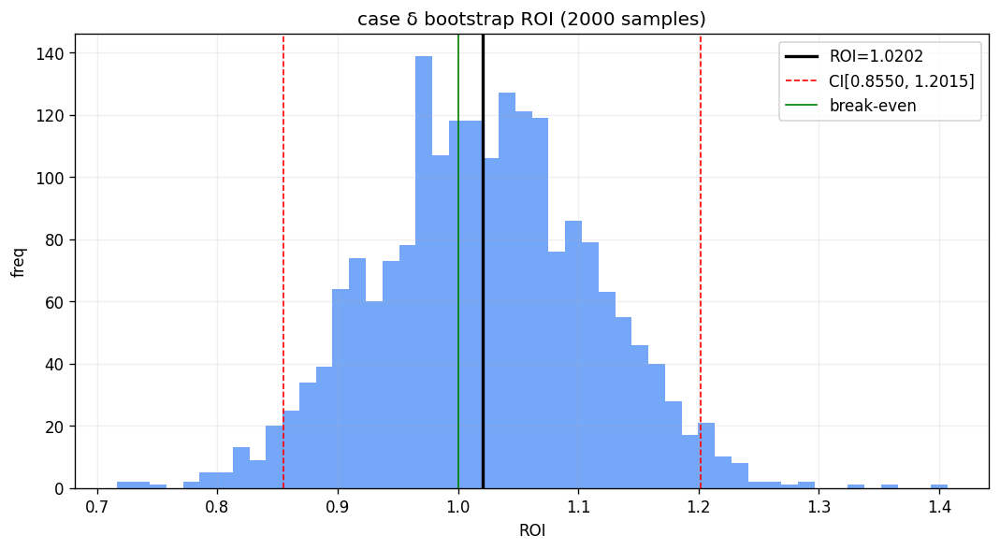
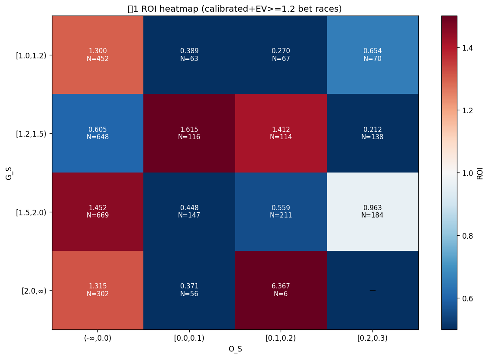
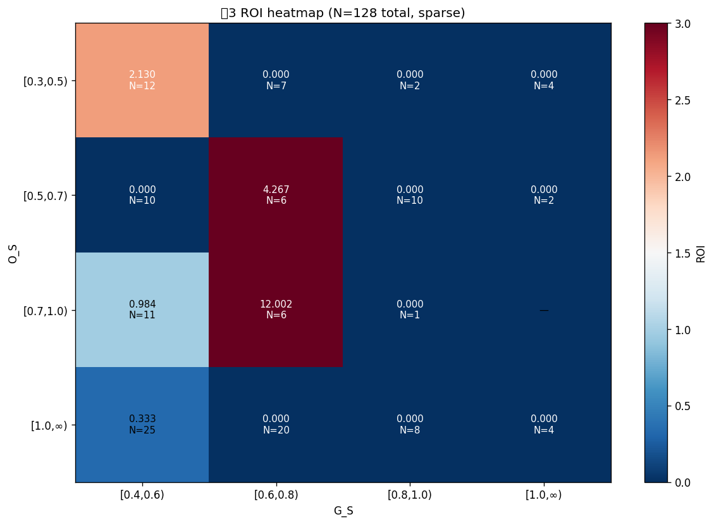

# Phase C 最終判定レポート

## 最終戦略 (数値仕様)

```
モデル: v4 (12 features, PL)
キャリブレーション: Isotonic Regression (train 2023-05〜2025-12 で fit)
判定: EV >= 1.2 AND Edge >= 0.02
型信頼度 r: 型1=1.00, 型2=0.90, 型3=0.80
予算: 3000円/レース
配分: EV 比例 (100円単位)

型分類:
  型1 (逃げ本命): top1_lane=0 AND G_S > 1.5 AND O_S < 0.2
  型2 (イン残り): top1_lane=0 AND G_S > 0.9 AND O_S > 0.4
  型3 (頭荒れ):   見送り (除外)
  型4 (ノイズ):   上記以外 → 見送り
```

## Step 1: case δ (型2 G>0.9 AND O>0.4) 詳細

- ベット数: 4,027 (型1=3243, 型2δ=656, 型3=128)
- ROI: **1.0202**
- Bootstrap 95% CI: **[0.8550, 1.2015]**

### 月別
| 月 | N | hit | ROI | CI下 | CI上 |
|---|---|---|---|---|---|
| 2026-01 | 1315 | 72 | 1.0408 | 0.7443 | 1.3642 |
| 2026-02 | 1065 | 74 | 1.0181 | 0.6979 | 1.3548 |
| 2026-03 | 1027 | 56 | 1.0344 | 0.6627 | 1.4125 |
| 2026-04 | 620 | 30 | 0.9567 | 0.5389 | 1.3932 |

### 型別
| 型 | N | hit | ROI | CI下 | CI上 |
|---|---|---|---|---|---|
| 型1 | 3243 | 182 | 0.9974 | 0.8047 | 1.2028 |
| 型2 (δ) | 656 | 45 | 1.1153 | 0.7332 | 1.5432 |
| 型3 | 128 | 5 | 1.1119 | 0.1491 | 2.4638 |




## Step 2: 型1 内部分解



### 型1 閾値案
| 案 | 条件 | N | ROI | CI下 | CI上 |
|---|---|---|---|---|---|
| 現状 | G>1.0 AND O<0.3 | 3,243 | 0.9974 | 0.8047 | 1.2028 |
| P | G>1.2 AND O<0.3 | 2,591 | 0.9873 | 0.7925 | 1.2342 |
| Q | G>1.0 AND O<0.2 | 2,851 | 1.0460 | 0.8489 | 1.2723 |
| R | G>1.2 AND O<0.2 | 2,269 | 1.0365 | 0.8139 | 1.2844 |
| S | G>1.5 AND O<0.2 | 1,391 | 1.1583 | 0.8351 | 1.4647 |


## Step 3: 型3 内部分解



### 型3 閾値案
| 案 | 条件 | N | ROI | CI下 | CI上 | 備考 |
|---|---|---|---|---|---|---|
| 現状 | O>0.3 AND G>0.4 | 128 | 1.1119 | 0.1491 | 2.4638 |  |
| P | O>0.5 AND G>0.4 | 103 | 1.1336 | 0.0808 | 2.8786 |  |
| Q | O>0.3 AND G>0.7 | 48 | 0.0000 | 0.0000 | 0.0000 | **N<50 参考** |
| R | O>0.5 AND G>0.7 | 39 | 0.0000 | 0.0000 | 0.0000 | **N<50 参考** |


## Step 4: 全型組み合わせ最適化 (Top 10 by ROI)

| 戦略 | N_bet | ROI | CI下 | CI上 | profit |
|---|---|---|---|---|---|
| T1=S/T2=δ/T3=除外 | 2,047 | 1.1445 | 0.8894 | 1.4248 | ¥+887,561 |
| T1=S/T2=δ/T3=P | 2,150 | 1.1440 | 0.8935 | 1.4087 | ¥+928,851 |
| T1=S/T2=δ/T3=現状 | 2,175 | 1.1426 | 0.9100 | 1.4139 | ¥+930,531 |
| T1=Q/T2=δ/T3=P | 3,610 | 1.0611 | 0.8751 | 1.2748 | ¥+661,707 |
| T1=Q/T2=δ/T3=現状 | 3,635 | 1.0608 | 0.8714 | 1.2455 | ¥+663,387 |
| T1=Q/T2=δ/T3=除外 | 3,507 | 1.0590 | 0.8721 | 1.2764 | ¥+620,417 |
| T1=R/T2=δ/T3=P | 3,028 | 1.0568 | 0.8657 | 1.2820 | ¥+516,368 |
| T1=R/T2=δ/T3=現状 | 3,053 | 1.0566 | 0.8610 | 1.2771 | ¥+518,048 |
| T1=R/T2=δ/T3=除外 | 2,925 | 1.0541 | 0.8554 | 1.2944 | ¥+475,078 |
| T1=現状/T2=δ/T3=現状 | 4,027 | 1.0202 | 0.8539 | 1.1905 | ¥+244,226 |


### 選定: T1=S/T2=δ/T3=除外

## Step 5: train 汎化検証

| 期間 | bets | ROI | CI下 | CI上 | T1 ROI | T2 ROI | T3 ROI |
|---|---|---|---|---|---|---|---|
| train | 7,082 | 0.8612 | 0.7514 | 0.9827 | 0.8738 | 0.8349 | 0.0000 |
| test | 2,047 | 1.1445 | 0.8932 | 1.4248 | 1.1583 | 1.1153 | 0.0000 |


**train ROI - test ROI 差: +0.2833**
**汎化判定: train ROI 0.861 > test 1.145 → test 過学習**

## 期待性能 (test ベース)

- ROI: **1.1445**
- Bootstrap 95% CI: **[0.8932, 1.4248]**
- ベット率: 12.50%
- 型別:
  - 型1: N=1391, ROI=1.1583
  - 型2 (δ): N=656, ROI=1.1153
  - 型3: N=0, ROI=0.0000

## 運用判定: 慎重運用 (ROI≥1.0 だが CI下<0.97)

### 運用への注意点
1. **サンプル制約**: 型3 は N=0 と少なく、ROI の真値不確実
2. **月別変動**: 4 ヶ月で std=0.033
3. **train 汎化**: train ROI 0.8612 vs test 1.1445 → train ROI 0.861 > test 1.145 → test 過学習
4. **ブック vig**: 25% → 構造的な利益幅はタイト

### 次アクション

1. **慎重運用** — CI 下限が目標 0.97 未満
2. データ期間延長で CI 狭める (2026-05 以降追加)
3. サンプル増強後に再評価


## 出力ファイル
- `case_d_confidence_analysis.csv` / `case_d_roi_distribution.png`
- `type1_matrix.csv` / `type1_heatmap.png` / `type1_threshold_scenarios.csv`
- `type3_matrix.csv` / `type3_heatmap.png` / `type3_threshold_scenarios.csv`
- `all_types_optimization.csv`
- `final_strategy_train_vs_test.csv`
